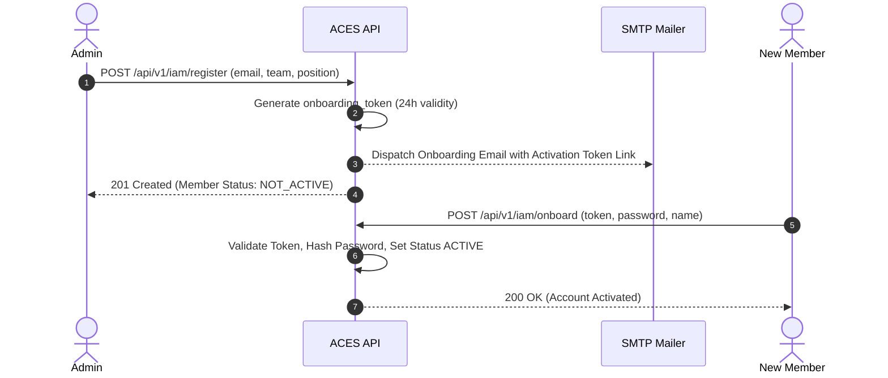

# ACES API — Reference Documentation & API Manual

This document serves as the **Single Source of Truth (SSOT)** for all RESTful API endpoints exposed by the **ACES API** backend system. It provides precise interface definitions, access control requirements, request/response payload schemas, error codes, and runnable cURL commands.

---

## Table of Contents
1. [General System Specifications](#1-general-system-specifications)
   - [Base URLs](#base-urls)
   - [HTTP Request Headers](#http-request-headers)
   - [Unified API Response Envelope](#unified-api-response-envelope)
   - [Standard HTTP Status Codes & Error Taxonomy](#standard-http-status-codes--error-taxonomy)
2. [Authentication & Authorization Framework](#2-authentication--authorization-framework)
   - [JWT Token Strategy](#jwt-token-strategy)
   - [Role-Based Access Control (RBAC) & Authority Matrix](#role-based-access-control-rbac--authority-matrix)
   - [Member Onboarding Lifecycle](#member-onboarding-lifecycle)
3. [System Health Endpoints](#3-system-health-endpoints)
4. [Identity & Access Management (IAM) Module](#4-identity--access-management-iam-module)
5. [Events Module](#5-events-module)
6. [Forms & Responses Module](#6-forms--responses-module)
7. [Announcements Module](#7-announcements-module)
8. [Gallery & Digital Asset Management Module](#8-gallery--digital-asset-management-module)

---

## 1. General System Specifications

### Base URLs
| Environment | Base URL |
| :--- | :--- |
| **Local Development** | `http://localhost:5000` |
| **API Version 1 Prefix** | `http://localhost:5000/api/v1` |
| **Production** | `https://api.aces.association/api/v1` |

### HTTP Request Headers
For JSON requests:
```http
Content-Type: application/json
Accept: application/json
```

For protected endpoints, attach the JWT token via HTTP Header OR Cookie:
```http
Authorization: Bearer <your_jwt_token>
```
*Note: The API also accepts the token automatically via HTTP-Only cookie `auth_token` or `jwt`.*

---

### Unified API Response Envelope

All API endpoints return responses encapsulated in a standardized envelope.

#### Success Envelope (`200 OK`, `201 Created`)
```json
{
  "success": true,
  "data": { ... },
  "error": null
}
```

#### Error Envelope (`400`, `401`, `403`, `404`, `409`, `500`)
```json
{
  "success": false,
  "data": null,
  "error": {
    "code": "ERROR_CODE_STRING",
    "message": "Human-readable description of the error."
  }
}
```

---

### Standard HTTP Status Codes & Error Taxonomy

| HTTP Status | Error Code (`error.code`) | Description / Common Trigger |
| :---: | :--- | :--- |
| **`200`** | `N/A` | Request executed successfully. |
| **`201`** | `N/A` | Resource created successfully. |
| **`400`** | `INVALID_INPUT` | Validation failure, missing required fields, or invalid payload schema. |
| **`401`** | `UNAUTHORIZED` | Authentication token missing, invalid, or expired. Account not activated. |
| **`403`** | `FORBIDDEN` | Authenticated user lacks required roles/authorities to access resource. |
| **`404`** | `NOT_FOUND` | Requested resource ID or route does not exist. |
| **`409`** | `CONFLICT` | Resource collision (e.g. duplicate email during registration). |
| **`500`** | `INTERNAL_ERROR` | Unhandled server error or database fault. |

---

## 2. Authentication & Authorization Framework

### JWT Token Strategy
- **Token Claims Payload**: `{ id, email, team, position, roles }`
- **Signing Algorithm**: HMAC SHA-256 (`HS256`)
- **Default Token Validity**: 7 Days (`7d`)

---

### Role-Based Access Control (RBAC) & Authority Matrix

Access to protected endpoints is governed by an **Authority Resolution Engine** configured in `authorities.json`.

#### User Roles (`roles`)
`admin`, `web_team`, `leader`, `tech_team`, `media_team`, `marketing_team`, `treasury_team`, `event_team`, `editorial_team`, `dnp_team`, `production_team`, `faculty`.

#### Authority Mapping (`authorities.json`)
```json
{
  "authorities": {
    "*.*": ["admin"],
    "members.*": ["admin"],
    "events.*": ["event_team"],
    "announcements.*": ["marketing_team"],
    "forms.*": ["event_team", "editorial_team"],
    "gallery.*": ["media_team", "editorial_team"],
    "*.read": ["*"]
  }
}
```

---

### Member Onboarding Lifecycle



---

## 3. System Health Endpoints

### 3.1 Root System Health
Check core application status and uptime.

- **Method**: `GET`
- **Endpoint**: `/health`
- **Auth**: Public
- **Response (`200 OK`)**:
  ```json
  {
    "success": true,
    "data": {
      "status": "UP",
      "uptime": 1245.82,
      "timestamp": "2026-08-14T21:55:00.000Z"
    },
    "error": null
  }
  ```
- **cURL Example**:
  ```bash
  curl -X GET http://localhost:5000/health
  ```

---

### 3.2 API v1 Service Health
Check API version 1 module status.

- **Method**: `GET`
- **Endpoint**: `/api/v1/health`
- **Auth**: Public
- **Response (`200 OK`)**:
  ```json
  {
    "success": true,
    "data": {
      "status": "UP",
      "version": "1.0.0",
      "timestamp": "2026-08-14T21:55:00.000Z"
    },
    "error": null
  }
  ```

---

## 4. Identity & Access Management (IAM) Module

### 4.1 Admin Register Member
Registers a new association member. Sends an onboarding activation link to their email address.

- **Method**: `POST`
- **Endpoint**: `/api/v1/iam/register`
- **Auth**: Required (`admin` role or `members.register` authority)
- **Content-Type**: `application/json` OR `multipart/form-data` (if uploading `profile_photo`)
- **Request Body Fields**:
  | Field | Type | Required | Description |
  | :--- | :--- | :---: | :--- |
  | `email` | `String` | Yes | Member email address. Must be unique. |
  | `team` | `String` | Yes | Association team (e.g. `Web Team`, `Technical Team`, `Media Team`, `Event Team`, `Editorial Team`). |
  | `position` | `String` | Yes | Position in team (e.g. `Head`, `Joint Head`, `Member`, `General Secretary`). |
  | `name` | `String` | No | Member full name (can be provided later during onboarding). |
  | `roles` | `Array<String>` | No | Explicit custom roles override/extension. |
  | `profile_photo` | `File` | No | Image file upload (JPEG/PNG/WebP, max 5MB). |
  | `social_links` | `Object` / `String` | No | `{ "linkedin": "...", "instagram": "...", "github": "..." }` |

- **Response (`201 Created`)**:
  ```json
  {
    "success": true,
    "data": {
      "id": "66bc1234567890abcdef1001",
      "name": "",
      "email": "alex.mercer@college.edu",
      "team": "Web Team",
      "position": "Head",
      "status": "NOT_ACTIVE",
      "roles": ["web_team"],
      "profile_photo_url": "https://res.cloudinary.com/aces/image/upload/v123/profile.jpg",
      "social_links": {
        "linkedin": "",
        "instagram": "",
        "github": ""
      },
      "createdAt": "2026-08-14T21:00:00.000Z",
      "updatedAt": "2026-08-14T21:00:00.000Z"
    },
    "error": null
  }
  ```

- **Error Responses**:
  - `400 INVALID_INPUT`: Missing email, team, or position; invalid team/position combination.
  - `409 CONFLICT`: Member with email already exists.

- **cURL Example**:
  ```bash
  curl -X POST http://localhost:5000/api/v1/iam/register \
    -H "Authorization: Bearer <ADMIN_JWT_TOKEN>" \
    -H "Content-Type: application/json" \
    -d '{
      "email": "alex.mercer@college.edu",
      "team": "Web Team",
      "position": "Head"
    }'
  ```

---

### 4.2 Admin Bulk Register Members via Published Google Sheet (CSV)
Bulk registers multiple members from a published Google Sheet in CSV format containing columns for `name`, `email`, `team`, and `position`. Automatically generates single-use 24-hour onboarding tokens and dispatches onboarding invitation emails to each member.

- **Method**: `POST`
- **Endpoint**: `/api/v1/iam/bulk-register`
- **Auth**: Required (`admin` role or `members.register` authority)
- **Content-Type**: `application/json`
- **Request Body Fields**:
  | Field | Type | Required | Description |
  | :--- | :--- | :---: | :--- |
  | `sheet_url` | `String` | Yes | URL of published Google Sheet in CSV format (or standard edit URL auto-converted to export CSV). |

- **Response (`201 Created`)**:
  ```json
  {
    "success": true,
    "data": {
      "total": 3,
      "successfulCount": 2,
      "failedCount": 1,
      "successful": [
        {
          "id": "66bc1234567890abcdef1001",
          "name": "Alice Walker",
          "email": "alice.walker@college.edu",
          "team": "Web Team",
          "position": "Head",
          "status": "NOT_ACTIVE",
          "roles": ["web_team"]
        },
        {
          "id": "66bc1234567890abcdef1002",
          "name": "Bob Vance",
          "email": "bob.vance@college.edu",
          "team": "Technical Team",
          "position": "Member",
          "status": "NOT_ACTIVE",
          "roles": ["tech_team"]
        }
      ],
      "failed": [
        {
          "row": 4,
          "email": "duplicate@college.edu",
          "reason": "A member with this email already exists."
        }
      ]
    },
    "error": null
  }
  ```

- **Error Responses**:
  - `400 INVALID_INPUT`: Missing or malformed sheet URL, unreachable URL, un-published HTML response, missing mandatory CSV columns (`email`, `team`, `position`).
  - `401 UNAUTHORIZED`: Missing or invalid Bearer JWT token.
  - `403 FORBIDDEN`: Non-admin access attempt.

- **cURL Example**:
  ```bash
  curl -X POST http://localhost:5000/api/v1/iam/bulk-register \
    -H "Authorization: Bearer <ADMIN_JWT_TOKEN>" \
    -H "Content-Type: application/json" \
    -d '{
      "sheet_url": "https://docs.google.com/spreadsheets/d/e/2PACX-1vQ.../pub?output=csv"
    }'
  ```

---

### 4.3 Complete Member Onboarding
Public endpoint triggered by new members via the onboarding token sent to their email. Validates the activation token, sets account password, updates full name, and activates status (`ACTIVE`).

- **Method**: `POST`
- **Endpoint**: `/api/v1/iam/onboard`
- **Auth**: Public
- **Request Body Fields**:
  | Field | Type | Required | Description |
  | :--- | :--- | :---: | :--- |
  | `token` | `String` | Yes | 64-character hexadecimal onboarding token. |
  | `password` | `String` | Yes | Member password. |
  | `name` | `String` | No | Member full name. |

- **Response (`200 OK`)**:
  ```json
  {
    "success": true,
    "data": {
      "id": "66bc1234567890abcdef1001",
      "name": "Alex Mercer",
      "email": "alex.mercer@college.edu",
      "team": "Web Team",
      "position": "Head",
      "status": "ACTIVE",
      "roles": ["web_team"],
      "profile_photo_url": ""
    },
    "error": null
  }
  ```

- **Error Responses**:
  - `400 INVALID_INPUT`: Invalid or expired onboarding token; missing token or password.

---

### 4.3 Member Login
Authenticates member credentials, returns account details, issues a JWT token, and sets HTTP-Only `auth_token` cookie.

- **Method**: `POST`
- **Endpoint**: `/api/v1/iam/login`
- **Auth**: Public
- **Request Body Fields**:
  | Field | Type | Required | Description |
  | :--- | :--- | :---: | :--- |
  | `email` | `String` | Yes | Account email address. |
  | `password` | `String` | Yes | Account password. |

- **Response (`200 OK`)**:
  ```json
  {
    "success": true,
    "data": {
      "member": {
        "id": "66bc1234567890abcdef1001",
        "name": "Alex Mercer",
        "email": "alex.mercer@college.edu",
        "team": "Web Team",
        "position": "Head",
        "status": "ACTIVE",
        "roles": ["web_team"],
        "profile_photo_url": "https://res.cloudinary.com/aces/image/upload/v123/profile.jpg",
        "social_links": {
          "linkedin": "https://linkedin.com/in/alexmercer",
          "instagram": "https://instagram.com/alexmercer",
          "github": "https://github.com/alexmercer"
        }
      }
    },
    "error": null
  }
  ```
  *Response Headers include*: `Set-Cookie: auth_token=<jwt_token>; HttpOnly; Path=/`

- **Error Responses**:
  - `401 UNAUTHORIZED`: Invalid email or password; or account status is `NOT_ACTIVE`.

---

### 4.4 List Association Members
Retrieves list of active public association members. Executive/Internal administrative accounts are automatically excluded from response.

- **Method**: `GET`
- **Endpoint**: `/api/v1/iam/members`
- **Auth**: Optional / Public
- **Query Parameters**:
  | Parameter | Type | Required | Description |
  | :--- | :--- | :---: | :--- |
  | `team` | `String` | No | Case-insensitive team filter (e.g. `Web Team`, `Technical Team`). |
  | `status` | `String` | No | Filter by status (`ACTIVE` or `NOT_ACTIVE`). |

- **Response (`200 OK`)**:
  ```json
  {
    "success": true,
    "data": {
      "members": [
        {
          "id": "66bc1234567890abcdef1001",
          "name": "Alex Mercer",
          "email": "alex.mercer@college.edu",
          "team": "Web Team",
          "position": "Head",
          "status": "ACTIVE",
          "roles": ["web_team"],
          "profile_photo_url": "https://res.cloudinary.com/aces/image/upload/v123/profile.jpg",
          "social_links": {
            "linkedin": "https://linkedin.com/in/alexmercer",
            "instagram": "https://instagram.com/alexmercer",
            "github": "https://github.com/alexmercer"
          }
        }
      ]
    },
    "error": null
  }
  ```

---

### 4.5 Get Member Profile by ID

- **Method**: `GET`
- **Endpoint**: `/api/v1/iam/members/:id`
- **Auth**: Optional / Public
- **Path Parameters**:
  | Parameter | Type | Description |
  | :--- | :--- | :--- |
  | `id` | `String` | 24-character MongoDB ObjectId of member. |

- **Response (`200 OK`)**:
  ```json
  {
    "success": true,
    "data": {
      "id": "66bc1234567890abcdef1001",
      "name": "Alex Mercer",
      "email": "alex.mercer@college.edu",
      "team": "Web Team",
      "position": "Head",
      "status": "ACTIVE",
      "roles": ["web_team"],
      "profile_photo_url": "https://res.cloudinary.com/aces/image/upload/v123/profile.jpg",
      "social_links": {
        "linkedin": "https://linkedin.com/in/alexmercer",
        "instagram": "https://instagram.com/alexmercer",
        "github": "https://github.com/alexmercer"
      }
    },
    "error": null
  }
  ```

- **Error Responses**:
  - `404 NOT_FOUND`: Member not found or member belongs to internal administrative team (`Executive`).

---

### 4.6 Update Member Profile
Updates member details. Non-admin members can only update their own profile (self-update) and cannot modify `status`, `roles`, `email`, or `team`. Admins can update any member and modify all fields.

- **Method**: `PUT`
- **Endpoint**: `/api/v1/iam/members/:id`
- **Auth**: Required (Self or `admin` role)
- **Content-Type**: `application/json` OR `multipart/form-data` (if uploading new `profile_photo`)
- **Request Body Fields**: `name`, `position`, `team` (admin only), `roles` (admin only), `status` (admin only), `social_links`, `profile_photo` (file upload).

- **Response (`200 OK`)**:
  ```json
  {
    "success": true,
    "data": {
      "id": "66bc1234567890abcdef1001",
      "name": "Alex Mercer",
      "email": "alex.mercer@college.edu",
      "team": "Web Team",
      "position": "Head",
      "status": "ACTIVE",
      "roles": ["web_team"],
      "profile_photo_url": "https://res.cloudinary.com/aces/image/upload/v123/new_photo.jpg",
      "social_links": {
        "linkedin": "https://linkedin.com/in/alexmercer_updated",
        "instagram": "https://instagram.com/alexmercer",
        "github": "https://github.com/alexmercer"
      }
    },
    "error": null
  }
  ```

- **Error Responses**:
  - `403 FORBIDDEN`: Attempting to update another member's profile without admin role.
  - `404 NOT_FOUND`: Member ID not found.

---

### 4.7 Delete Member

- **Method**: `DELETE`
- **Endpoint**: `/api/v1/iam/members/:id`
- **Auth**: Required (`admin` role / `members.delete` authority)
- **Response (`200 OK`)**:
  ```json
  {
    "success": true,
    "data": {
      "message": "Member successfully removed."
    },
    "error": null
  }
  ```

---

## 5. Events Module

### 5.1 List All Events
Retrieves list of all events, sorted by creation date descending.

- **Method**: `GET`
- **Endpoint**: `/api/v1/events`
- **Auth**: Optional / Public
- **Response (`200 OK`)**:
  ```json
  {
    "success": true,
    "data": {
      "events": [
        {
          "id": "66bc20001122334455667788",
          "overview": "Annual Hackathon 2026",
          "description": "24-hour intense competitive programming and web development event.",
          "terms": "Must be an active student. Teams of 2 to 4 members.",
          "reg_form_id": "66bc30001122334455667799",
          "banner_url": "https://res.cloudinary.com/aces/image/upload/v123/hackathon.jpg",
          "isHighlight": true,
          "auditing": {
            "created_by": "66bc1234567890abcdef1001",
            "created_at": "2026-08-14T10:00:00.000Z",
            "updated_by": "66bc1234567890abcdef1001",
            "updated_at": "2026-08-14T10:00:00.000Z"
          }
        }
      ]
    },
    "error": null
  }
  ```

---

### 5.2 Get Highlighted Homepage Events
Retrieves only events marked with `isHighlight: true` (maximum 4 events returned).

- **Method**: `GET`
- **Endpoint**: `/api/v1/events/highlights`
- **Auth**: Optional / Public
- **Response (`200 OK`)**:
  ```json
  {
    "success": true,
    "data": {
      "events": [
        {
          "id": "66bc20001122334455667788",
          "overview": "Annual Hackathon 2026",
          "description": "24-hour intense competitive programming...",
          "terms": "Must be an active student.",
          "reg_form_id": "66bc30001122334455667799",
          "banner_url": "https://res.cloudinary.com/aces/image/upload/v123/hackathon.jpg",
          "isHighlight": true,
          "auditing": {
            "created_by": "66bc1234567890abcdef1001",
            "created_at": "2026-08-14T10:00:00.000Z",
            "updated_by": "66bc1234567890abcdef1001",
            "updated_at": "2026-08-14T10:00:00.000Z"
          }
        }
      ]
    },
    "error": null
  }
  ```

---

### 5.3 Get Event by ID

- **Method**: `GET`
- **Endpoint**: `/api/v1/events/:id`
- **Auth**: Optional / Public
- **Response (`200 OK`)**:
  ```json
  {
    "success": true,
    "data": {
      "id": "66bc20001122334455667788",
      "overview": "Annual Hackathon 2026",
      "description": "24-hour intense competitive programming...",
      "terms": "Must be an active student.",
      "reg_form_id": "66bc30001122334455667799",
      "banner_url": "https://res.cloudinary.com/aces/image/upload/v123/hackathon.jpg",
      "isHighlight": true,
      "auditing": {
        "created_by": "66bc1234567890abcdef1001",
        "created_at": "2026-08-14T10:00:00.000Z",
        "updated_by": "66bc1234567890abcdef1001",
        "updated_at": "2026-08-14T10:00:00.000Z"
      }
    },
    "error": null
  }
  ```

- **Error Responses**:
  - `400 INVALID_INPUT`: Invalid event ID format.
  - `404 NOT_FOUND`: Event with given ID not found.

---

### 5.4 Create Event
Creates a new event. Enforces a maximum limit of **4 highlighted events** in the system when `isHighlight: true`.

- **Method**: `POST`
- **Endpoint**: `/api/v1/events`
- **Auth**: Required (`event_team` role / `events.create` authority)
- **Request Body Fields**:
  | Field | Type | Required | Description |
  | :--- | :--- | :---: | :--- |
  | `overview` | `String` | Yes | Short summary statement. |
  | `description` | `String` | Yes | Comprehensive event details (Markdown supported). |
  | `terms` | `String` | Yes | Terms, rules, and eligibility criteria. |
  | `reg_form_id` | `String` | No | MongoDB ObjectId of associated dynamic Form. |
  | `banner_url` | `String` | No | Cloudinary media URL for event banner image. |
  | `isHighlight` | `Boolean` | No | Flag to highlight event on home page (Default: `false`, Max limit: 4). |

- **Response (`201 Created`)**:
  ```json
  {
    "success": true,
    "data": {
      "id": "66bc20001122334455667788",
      "overview": "Annual Hackathon 2026",
      "description": "24-hour intense competitive programming...",
      "terms": "Must be an active student.",
      "reg_form_id": "66bc30001122334455667799",
      "banner_url": "https://res.cloudinary.com/aces/image/upload/v123/hackathon.jpg",
      "isHighlight": true,
      "auditing": {
        "created_by": "66bc1234567890abcdef1001",
        "created_at": "2026-08-14T10:00:00.000Z",
        "updated_by": "66bc1234567890abcdef1001",
        "updated_at": "2026-08-14T10:00:00.000Z"
      }
    },
    "error": null
  }
  ```

- **Error Responses**:
  - `400 INVALID_INPUT`: Missing required fields (`overview`, `description`, `terms`), invalid `reg_form_id`, or highlighted events limit exceeded (>4).

---

### 5.5 Update Event
Updates an existing event. Validates highlight count constraint if setting `isHighlight: true`.

- **Method**: `PUT`
- **Endpoint**: `/api/v1/events/:id`
- **Auth**: Required (`event_team` role / `events.update` authority)
- **Response (`200 OK`)**: Standard event payload with updated fields and `auditing.updated_at` / `updated_by`.

---

### 5.6 Delete Event

- **Method**: `DELETE`
- **Endpoint**: `/api/v1/events/:id`
- **Auth**: Required (`event_team` role / `events.delete` authority)
- **Response (`200 OK`)**:
  ```json
  {
    "success": true,
    "data": {
      "message": "Event successfully removed."
    },
    "error": null
  }
  ```

---

## 6. Forms & Responses Module

### 6.1 Create Dynamic Form
Creates a form along with structured question definitions.

- **Method**: `POST`
- **Endpoint**: `/api/v1/forms`
- **Auth**: Required (`editorial_team` or `event_team` role / `forms.create` authority)
- **Request Body Fields**:
  ```json
  {
    "title": "Hackathon 2026 Registration Form",
    "description": "Fill out team details and track preferences.",
    "questions": [
      {
        "question_serial": 1,
        "question_statement": "What is your team name?",
        "question_type": "textual",
        "is_required": true,
        "textual_policy": { "max_len": 100 }
      },
      {
        "question_serial": 2,
        "question_statement": "Select your hackathon track",
        "question_type": "multiple_choice",
        "is_required": true,
        "multiple_choice_policy": {
          "type": "Single",
          "options": ["AI & ML", "Web3 / Blockchain", "Cloud & DevOps"]
        }
      },
      {
        "question_serial": 3,
        "question_statement": "Upload your proposal PDF",
        "question_type": "file",
        "is_required": false,
        "file_policy": {
          "supported_types": ["pdf"],
          "max_size_mb": 5
        }
      }
    ]
  }
  ```

- **Response (`201 Created`)**:
  ```json
  {
    "success": true,
    "data": {
      "form_id": "66bc30001122334455667799",
      "title": "Hackathon 2026 Registration Form",
      "description": "Fill out team details and track preferences.",
      "question_count": 3,
      "created_at": "2026-08-14T12:00:00.000Z"
    },
    "error": null
  }
  ```

---

### 6.2 List Paginated Forms

- **Method**: `GET`
- **Endpoint**: `/api/v1/forms`
- **Auth**: Optional / Public
- **Query Parameters**:
  | Parameter | Type | Default | Description |
  | :--- | :--- | :---: | :--- |
  | `page` | `Number` | `1` | Page index (1-based). |
  | `limit` | `Number` | `10` | Records per page (Max 100). |
  | `is_active` | `Boolean` | `undefined` | Filter by active form status (`true` / `false`). |

- **Response (`200 OK`)**:
  ```json
  {
    "success": true,
    "data": {
      "forms": [
        {
          "form_id": "66bc30001122334455667799",
          "title": "Hackathon 2026 Registration Form",
          "description": "Fill out team details and track preferences.",
          "is_active": true,
          "question_count": 3,
          "created_at": "2026-08-14T12:00:00.000Z"
        }
      ],
      "total": 1,
      "page": 1,
      "limit": 10,
      "total_pages": 1
    },
    "error": null
  }
  ```

---

### 6.3 Get Form Details & Questions

- **Method**: `GET`
- **Endpoint**: `/api/v1/forms/:form_id`
- **Auth**: Optional / Public
- **Response (`200 OK`)**:
  ```json
  {
    "success": true,
    "data": {
      "form_id": "66bc30001122334455667799",
      "title": "Hackathon 2026 Registration Form",
      "description": "Fill out team details and track preferences.",
      "is_active": true,
      "questions": [
        {
          "question_id": "66bc30001122334455667701",
          "question_serial": 1,
          "question_statement": "What is your team name?",
          "question_type": "textual",
          "is_required": true,
          "textual_policy": { "max_len": 100 },
          "multiple_choice_policy": { "type": "Single", "options": [] },
          "file_policy": { "supported_types": [], "max_size_mb": 5 }
        }
      ],
      "created_at": "2026-08-14T12:00:00.000Z",
      "updated_at": "2026-08-14T12:00:00.000Z"
    },
    "error": null
  }
  ```

---

### 6.4 Update Form Details & Question Set

- **Method**: `PUT`
- **Endpoint**: `/api/v1/forms/:form_id`
- **Auth**: Required (`forms.update` authority)
- **Request Body Fields**: `title`, `description`, `is_active` (`true`/`false`), `questions` (optional full replacement array).

---

### 6.5 Delete Form (Cascade Delete)
Deletes form document and cascades deletion to all related questions and submitted responses.

- **Method**: `DELETE`
- **Endpoint**: `/api/v1/forms/:form_id`
- **Auth**: Required (`forms.delete` authority)
- **Response (`200 OK`)**:
  ```json
  {
    "success": true,
    "data": {
      "form_id": "66bc30001122334455667799",
      "message": "Form and all associated data deleted successfully."
    },
    "error": null
  }
  ```

---

### 6.6 Submit Form Response
Submits answers to a form along with mandatory form filler identification (email). Answers are validated against policy rules (character limits, option validity, required questions). A single email can submit only one response per form.

- **Method**: `POST`
- **Endpoint**: `/api/v1/forms/:form_id/responses`
- **Auth**: Optional / Public (Attaches `member_id` if authenticated)
- **Request Body Fields**:
  ```json
  {
    "email": "filler@example.com",
    "answers": {
      "1": ["Cyber Knights"],
      "2": ["AI & ML"],
      "3": ["https://res.cloudinary.com/aces/raw/upload/v123/proposal.pdf"]
    }
  }
  ```

- **Response (`201 Created`)**:
  ```json
  {
    "success": true,
    "data": {
      "response_id": "66bc400011223344556677aa",
      "form_id": "66bc30001122334455667799",
      "email": "filler@example.com",
      "member_id": "66bc1234567890abcdef1001",
      "submitted_at": "2026-08-14T14:30:00.000Z"
    },
    "error": null
  }
  ```

- **Error Responses**:
  - `400 INVALID_INPUT`: Form filler email is missing/invalid, response has already been submitted with this email address, form is closed (`is_active: false`), missing required answers, textual answer exceeds `max_len`, or invalid multiple-choice selection.

---

### 6.7 Check Response Existence by Email
Checks whether a response has already been recorded for a specific email address on a form.

- **Method**: `GET`
- **Endpoint**: `/api/v1/forms/:form_id/responses/check`
- **Auth**: Optional / Public
- **Query Parameters**:
  | Parameter | Type | Required | Description |
  | :--- | :--- | :--- | :--- |
  | `email` | String | Yes | Form filler email address to query. |

- **Response (`200 OK`)**:
  ```json
  {
    "success": true,
    "data": {
      "form_id": "66bc30001122334455667799",
      "email": "filler@example.com",
      "exists": true
    },
    "error": null
  }
  ```

---

### 6.8 Get Form Responses List

- **Method**: `GET`
- **Endpoint**: `/api/v1/forms/:form_id/responses`
- **Auth**: Required (`forms.read_responses` authority)
- **Response (`200 OK`)**:
  ```json
  {
    "success": true,
    "data": {
      "form_id": "66bc30001122334455667799",
      "form_title": "Hackathon 2026 Registration Form",
      "total_responses": 1,
      "responses": [
        {
          "response_id": "66bc400011223344556677aa",
          "email": "filler@example.com",
          "member_id": "66bc1234567890abcdef1001",
          "submitted_at": "2026-08-14T14:30:00.000Z",
          "answers": {
            "1": ["Cyber Knights"],
            "2": ["AI & ML"]
          }
        }
      ]
    },
    "error": null
  }
  ```

---

### 6.9 Get Single Response Detail

- **Method**: `GET`
- **Endpoint**: `/api/v1/forms/:form_id/responses/:response_id`
- **Auth**: Required (`forms.read_responses` authority)
- **Response (`200 OK`)**: Detailed breakdown of single response entry.

---

## 7. Announcements Module

### 7.1 List All Announcements

- **Method**: `GET`
- **Endpoint**: `/api/v1/announcements`
- **Auth**: Optional / Public
- **Response (`200 OK`)**:
  ```json
  {
    "success": true,
    "data": [
      {
        "id": "66bc500011223344556677bb",
        "topic": "Registration Open for Hackathon 2026",
        "description": "Submit your team responses before August 25th!",
        "auditing": {
          "created_by": "66bc1234567890abcdef1001",
          "created_at": "2026-08-14T08:00:00.000Z",
          "updated_by": "66bc1234567890abcdef1001",
          "updated_at": "2026-08-14T08:00:00.000Z"
        }
      }
    ],
    "error": null
  }
  ```

---

### 7.2 Get Announcement by ID

- **Method**: `GET`
- **Endpoint**: `/api/v1/announcements/:id`
- **Auth**: Optional / Public

---

### 7.3 Create Announcement

- **Method**: `POST`
- **Endpoint**: `/api/v1/announcements`
- **Auth**: Required (`marketing_team` role / `announcements.create` authority)
- **Request Body Fields**:
  | Field | Type | Required | Description |
  | :--- | :--- | :---: | :--- |
  | `topic` | `String` | Yes | Announcement title / topic header. |
  | `description` | `String` | Yes | Announcement body text / Markdown content. |

- **Response (`201 Created`)**:
  ```json
  {
    "success": true,
    "data": {
      "id": "66bc500011223344556677bb",
      "topic": "Registration Open for Hackathon 2026",
      "description": "Submit your team responses before August 25th!",
      "auditing": {
        "created_by": "66bc1234567890abcdef1001",
        "created_at": "2026-08-14T08:00:00.000Z",
        "updated_by": "66bc1234567890abcdef1001",
        "updated_at": "2026-08-14T08:00:00.000Z"
      }
    },
    "error": null
  }
  ```

---

### 7.4 Update Announcement

- **Method**: `PUT`
- **Endpoint**: `/api/v1/announcements/:id`
- **Auth**: Required (`marketing_team` role / `announcements.update` authority)

---

### 7.5 Delete Announcement

- **Method**: `DELETE`
- **Endpoint**: `/api/v1/announcements/:id`
- **Auth**: Required (`marketing_team` role / `announcements.delete` authority)
- **Response (`200 OK`)**:
  ```json
  {
    "success": true,
    "data": {
      "message": "Announcement successfully removed."
    },
    "error": null
  }
  ```

---

## 8. Gallery & Digital Asset Management Module

### 8.1 Get Presigned Upload Signature
Generates a presigned Cloudinary upload signature enabling direct browser-to-CDN media uploads without streaming multi-megabyte binary data through Node.js application memory.

- **Method**: `GET`
- **Endpoint**: `/api/v1/gallery/upload-signature`
- **Auth**: Required (`media_team`, `editorial_team`, or `admin` role / `gallery.upload` authority)
- **Query Parameters**:
  | Parameter | Type | Required | Description |
  | :--- | :--- | :---: | :--- |
  | `folder` | `String` | Yes | Target Cloudinary storage folder (e.g. `events`, `profile_photos`, `magazines`). |
  | `resource_type` | `String` | Yes | Resource type classification (`image`, `video`, `raw`, `auto`). |

- **Response (`200 OK`)**:
  ```json
  {
    "success": true,
    "data": {
      "upload_url": "https://api.cloudinary.com/v1_1/aces-cloud/image/upload",
      "signature": "a1b2c3d4e5f67890123456789abcdef012345678",
      "timestamp": 1770984000,
      "api_key": "123456789012345",
      "folder": "aces/events"
    },
    "error": null
  }
  ```

- **Error Responses**:
  - `400 INVALID_INPUT`: Missing `folder` or `resource_type` query parameters, or invalid `resource_type`.
  - `401 UNAUTHORIZED`: Authentication token missing.
  - `403 FORBIDDEN`: User role does not possess `gallery.upload` authority.

- **cURL Example**:
  ```bash
  curl -X GET "http://localhost:5000/api/v1/gallery/upload-signature?folder=events&resource_type=image" \
    -H "Authorization: Bearer <USER_JWT_TOKEN>"
  ```

---

### 8.2 Create Gallery Showcase Item
Allows media team members to upload/record specific photos or videos with an assigned collection name.

- **Method**: `POST`
- **Endpoint**: `/api/v1/gallery/items`
- **Auth**: Required (`media_team`, `editorial_team`, or `admin` role / `gallery.create` authority)
- **Request Body Fields**:
  | Field | Type | Required | Description |
  | :--- | :--- | :---: | :--- |
  | `collection_name` | `String` | Yes | Target collection identifier (e.g. `Hackathon 2026`, `Tech Fest 2025`). |
  | `media_url` | `String` | Yes | Hosted CDN URL of photo or video. |
  | `media_type` | `String` | Yes | Media type classification (`image` or `video`). |
  | `title` | `String` | No | Optional media title or caption header. |
  | `caption` | `String` | No | Optional detailed caption or description. |

- **Response (`201 Created`)**:
  ```json
  {
    "success": true,
    "data": {
      "id": "66bc600011223344556677cc",
      "title": "Keynote Address",
      "caption": "Opening address by chief guest.",
      "media_url": "https://res.cloudinary.com/aces/image/upload/v123/keynote.jpg",
      "media_type": "image",
      "collection_name": "Hackathon 2026",
      "auditing": {
        "created_by": "66bc1234567890abcdef1001",
        "created_at": "2026-08-14T21:00:00.000Z",
        "updated_by": "66bc1234567890abcdef1001",
        "updated_at": "2026-08-14T21:00:00.000Z"
      }
    },
    "error": null
  }
  ```

---

### 8.3 Batch Upload Gallery Items
Batch upload multiple photos and videos under a unified collection name in a single request.

- **Method**: `POST`
- **Endpoint**: `/api/v1/gallery/items/batch`
- **Auth**: Required (`media_team`, `editorial_team`, or `admin` role / `gallery.create` authority)
- **Request Body Fields**:
  ```json
  {
    "collection_name": "Freshers Party 2025",
    "items": [
      {
        "title": "Group Photo",
        "media_url": "https://res.cloudinary.com/aces/image/upload/v123/group.jpg",
        "media_type": "image"
      },
      {
        "title": "Dance Performance",
        "media_url": "https://res.cloudinary.com/aces/video/upload/v123/dance.mp4",
        "media_type": "video"
      }
    ]
  }
  ```

- **Response (`201 Created`)**:
  ```json
  {
    "success": true,
    "data": {
      "collection_name": "Freshers Party 2025",
      "count": 2,
      "items": [ ... ]
    },
    "error": null
  }
  ```

---

### 8.4 Get Entire Gallery Showcase (Organized in Collections)
Retrieves the entire media showcase with all photos and videos grouped dynamically into their respective collections.

- **Method**: `GET`
- **Endpoint**: `/api/v1/gallery/showcase`
- **Auth**: Optional / Public
- **Response (`200 OK`)**:
  ```json
  {
    "success": true,
    "data": {
      "collections": [
        {
          "collection_name": "Hackathon 2026",
          "total_items": 5,
          "photos_count": 3,
          "videos_count": 2,
          "items": [
            {
              "id": "66bc600011223344556677cc",
              "title": "Keynote Address",
              "caption": "Opening address by chief guest.",
              "media_url": "https://res.cloudinary.com/aces/image/upload/v123/keynote.jpg",
              "media_type": "image",
              "collection_name": "Hackathon 2026",
              "auditing": {
                "created_by": "66bc1234567890abcdef1001",
                "created_at": "2026-08-14T21:00:00.000Z",
                "updated_by": "66bc1234567890abcdef1001",
                "updated_at": "2026-08-14T21:00:00.000Z"
              }
            }
          ]
        }
      ]
    },
    "error": null
  }
  ```

---

### 8.5 Get Media via Collection Name
Retrieves all photos and videos associated with a specific collection name.

- **Method**: `GET`
- **Endpoint**: `/api/v1/gallery/collections/:collection_name`
- **Auth**: Optional / Public
- **Path Parameters**:
  | Parameter | Type | Description |
  | :--- | :--- | :--- |
  | `collection_name` | `String` | URL-encoded name of the collection (e.g. `Hackathon%202026`). |

- **Response (`200 OK`)**:
  ```json
  {
    "success": true,
    "data": {
      "collection_name": "Hackathon 2026",
      "total_items": 5,
      "photos_count": 3,
      "videos_count": 2,
      "items": [ ... ]
    },
    "error": null
  }
  ```

---

### 8.6 List Summary of Collections
Retrieves a summary list of all available collection names with item counts and cover media URL.

- **Method**: `GET`
- **Endpoint**: `/api/v1/gallery/collections`
- **Auth**: Optional / Public
- **Response (`200 OK`)**:
  ```json
  {
    "success": true,
    "data": {
      "collections": [
        {
          "collection_name": "Hackathon 2026",
          "total_items": 5,
          "photos_count": 3,
          "videos_count": 2,
          "cover_url": "https://res.cloudinary.com/aces/image/upload/v123/keynote.jpg"
        }
      ]
    },
    "error": null
  }
  ```

---

### 8.7 Update Gallery Item
Updates details or collection assignment for an existing gallery media item.

- **Method**: `PUT`
- **Endpoint**: `/api/v1/gallery/items/:id`
- **Auth**: Required (`media_team`, `editorial_team`, or `admin` role / `gallery.update` authority)

---

### 8.8 Delete Gallery Item
Removes a photo or video item from the gallery.

- **Method**: `DELETE`
- **Endpoint**: `/api/v1/gallery/items/:id`
- **Auth**: Required (`media_team`, `editorial_team`, or `admin` role / `gallery.delete` authority)
- **Response (`200 OK`)**:
  ```json
  {
    "success": true,
    "data": {
      "message": "Gallery item successfully deleted."
    },
    "error": null
  }
  ```

